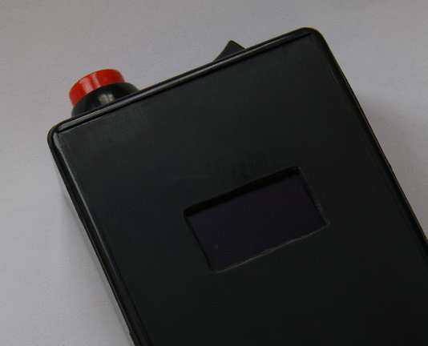
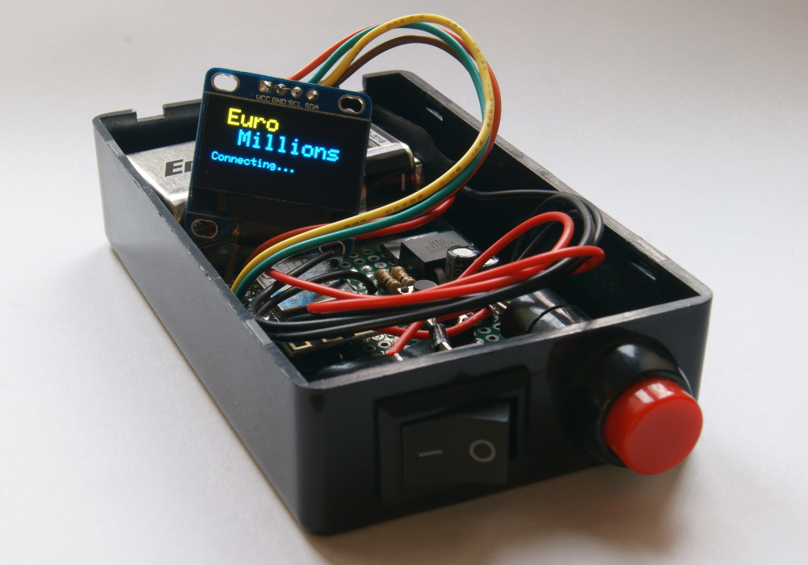
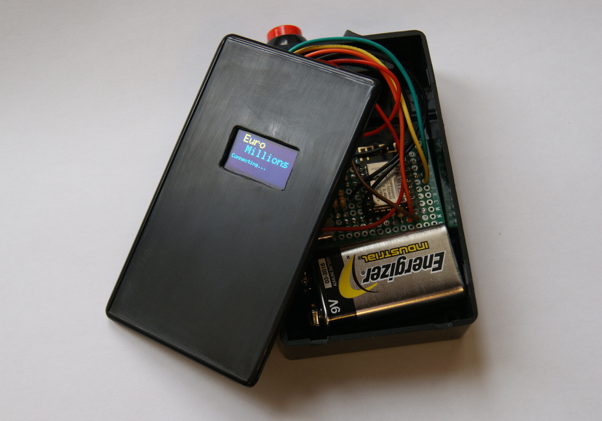

# EuroMillionsBox #

EuroMillionsBox is a ESP8266 based device to fetch the latest EuroMillions draw results.

The Arduino based code can easily be changed to suit other purposes.

## Build Instructions ##

The circuit is based on a [ESP-12F module](https://www.ebay.com/sch/i.html?_nkw=ESP-12F) with a [128x64 OLED display](https://www.ebay.com/sch/i.html?_nkw=128X64+OLED+I2C) and a [LD1117V33 regulator](https://www.ebay.com/sch/i.html?_nkw=LD1117V33). After building the [basic ESP-12 circuit](http://www.esp8266.com/wiki/doku.php?id=getting-started-with-the-esp8266) with reset and programming push buttons, connect the display to SCL and SDA (GPIO5 and GPIO4), the power button and the external push button between GPIO14 and ground.

On the Arduino IDE you need to install the [ESP8266 core](https://github.com/esp8266/Arduino) and the libraries 'Adafruit SSD1306' and 'Adafruit GFX Library'. Don't forget to set WIFI_SSID and WIFI_PASS on main sketch.

If everything is OK, after powering up, it will connect and display the latest result. A short press of the external button will scroll to previous results, a long press will fetch the results again.

I may post a full schematic and instructions in the future.

## License ##

EuroMillionsBox is released under the terms of the MIT License. See [LICENSE.txt](LICENSE.txt) for details.
